# Deploying Gramps on Github Pages Using Github Action Workflow

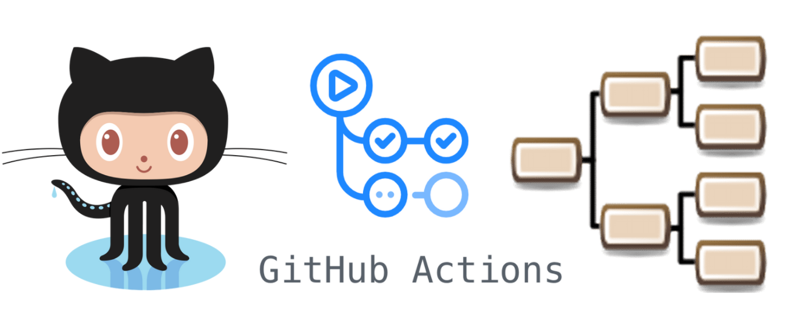

- [Deploying Gramps on Github Pages Using Github Action Workflow](#deploying-gramps-on-github-pages-using-github-action-workflow)
  - [Introduction](#introduction)
  - [What are the benefits of doing this?](#what-are-the-benefits-of-doing-this)
  - [Creating a Github Repository](#creating-a-github-repository)
  - [Enable Github Pages](#enable-github-pages)
  - [Git Clone Your Gramps Repo](#git-clone-your-gramps-repo)
  - [Export Your Gramps Family Tree as a GEDCOM File](#export-your-gramps-family-tree-as-a-gedcom-file)
  - [Create A Github Actions Workflow Config](#create-a-github-actions-workflow-config)
  - [Bug in Gramps CLI](#bug-in-gramps-cli)
  - [Push Files Up Into Github Repo](#push-files-up-into-github-repo)
  - [Verify GitHub Actions WorkFlow Build](#verify-github-actions-workflow-build)
  - [Browse Your Gramps Narrated Website](#browse-your-gramps-narrated-website)
  - [Pushing Updates To Your Gramps Website](#pushing-updates-to-your-gramps-website)

## Introduction

The Gramps opensource genealogy software allows you to export your family tree as a static html website, this tutorial will demostrate how to use the Gramps CLI, Github, Github Pages and Github Action Workflow to automate part

## What are the benefits of doing this?

* Free website hosting on Github Pages

* Benefits of using Githubs source control system

* Version history you can restore from if needed

* You can check in a GEDCOM file and it will build and publish the website for you

## Creating a Github Repository 

Log into your github account and create a new repository 

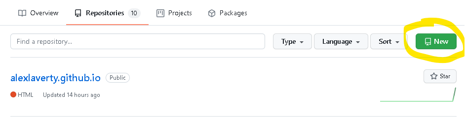

Give your repository a name, give it a description if you want, click **Public**, tick **Add a README.md file**, click **Create Repository**

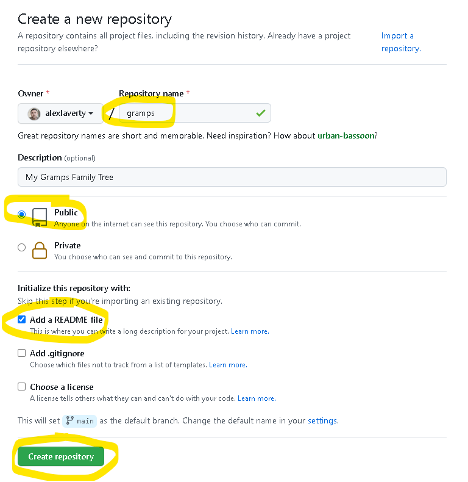

> For reference you can view this repository here 
<https://github.com/alexlaverty/gramps>

## Enable Github Pages

Now we'll enable the ability for this repository to host a simple static html website by enabling Github Pages, In your repository click **Settings** 

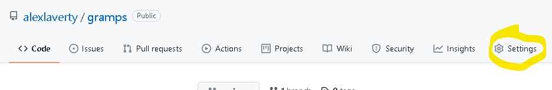

In **Settings**, click **Pages**, for Branch select **Main**, click **Save**

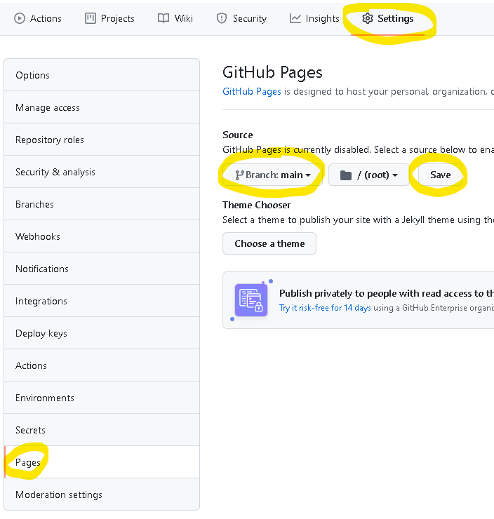

Take note of the URL for your Gramps website 

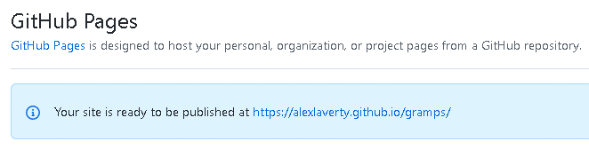

## Git Clone Your Gramps Repo

Click the **Code** tab, click the green Code button, copy the repository URL 

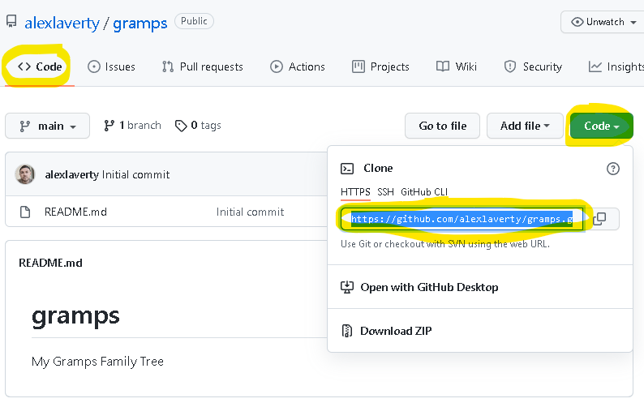

Open a terminal on your workstation and clone the repo, you will need to have a [git](https://git-scm.com/) client installed :

```
git clone https://github.com/alexlaverty/gramps.git

Cloning into 'gramps'...
remote: Enumerating objects: 3, done.
remote: Counting objects: 100% (3/3), done.
remote: Total 3 (delta 0), reused 0 (delta 0), pack-reused 0
Receiving objects: 100% (3/3), done.
```

## Export Your Gramps Family Tree as a GEDCOM File

Open up Gramps application and export your family tree as a GEDCOM file into your cloned gramps repository

In the Gramps application click **Family Trees -> Export**

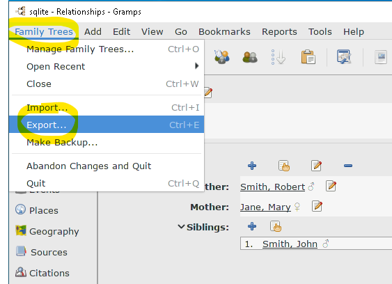

Click Next

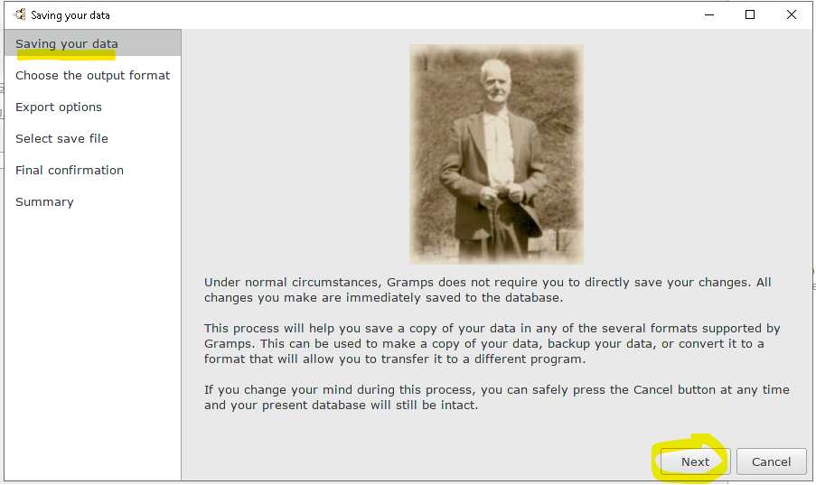

Select GEDCOM, click next

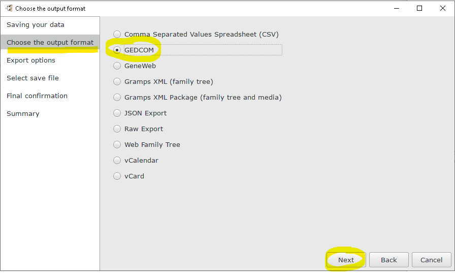

Click Next

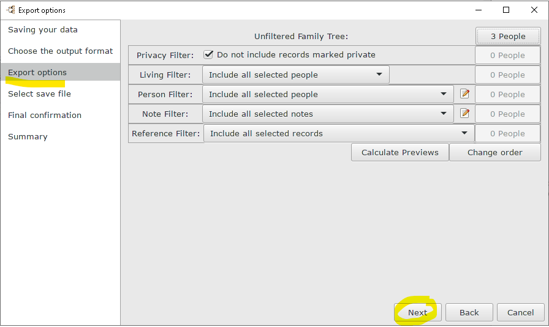

For name enter gramps.ged, for the folder destination select the gramps github repo we cloned in the previous steps, click **next**

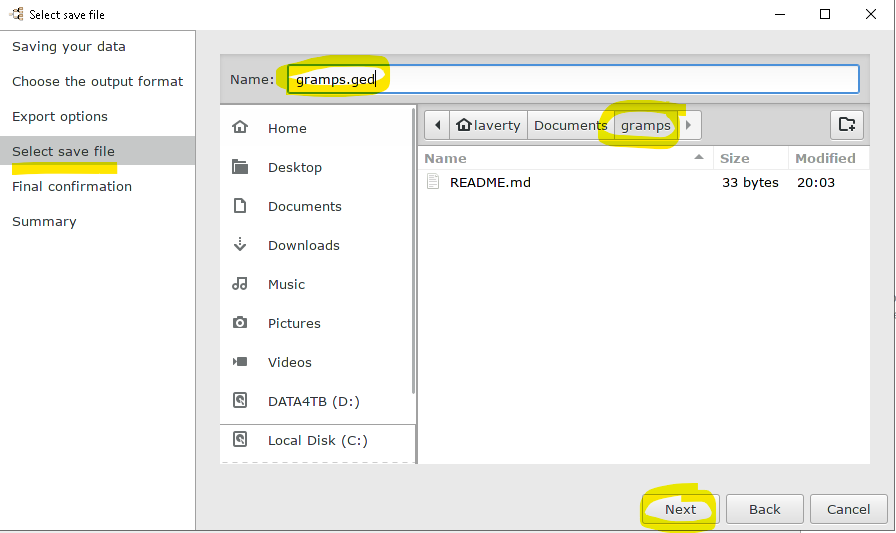


Click **Apply** 

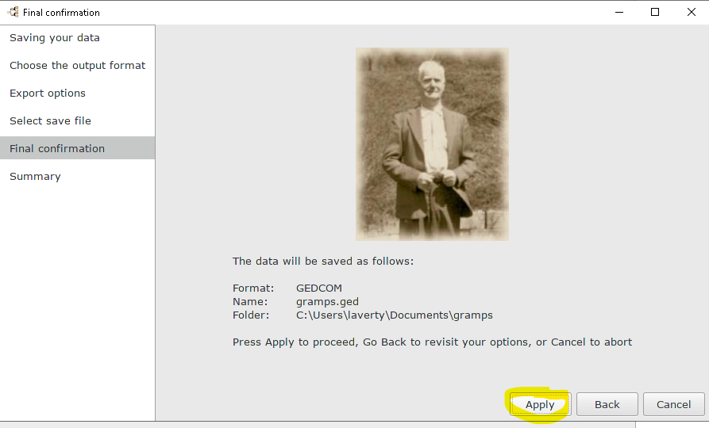

Verify the destination of the gramps export and click **close**

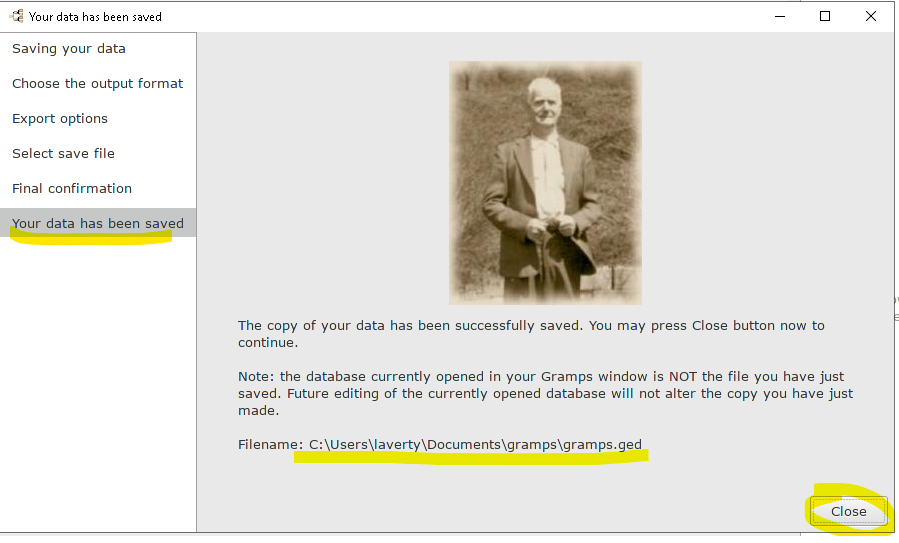

## Create A Github Actions Workflow Config

Now we will create a Github Workflow, the purpose of which, is it will trigger a build on checkin and compile the Gramps Narrated Website, the build will run on a ubuntu linux server inside a docker container that has gramps installed in it, the website will be generated via the Gramps CLI.

Inside your gramps repo folder, create the following folders and a yml config file.

```
.github/workflows/gramps.yml
```

Save the following Github Action Workflow config into the gramps.yml file


```
gramps -i gramps.ged -a report -p name=navwebpage,target=./
``` 
and the resulting html files will be commited and pushed to the github repo.

```
name: Gramps
on: [push]
jobs:
  build:
    runs-on: ubuntu-latest
    container: alexlaverty/gramps
    steps:
      - name: checkout
        uses: actions/checkout@v2 # checkout the repository content to github runner
         
      - name: Build Gramps Narrated Website
        run: |
          # Workaround for bug in database name in Gramps generic.py
          sed -i 's/name.txt/database.txt/g' /usr/lib/python3/dist-packages/gramps/gen/db/generic.py
          gramps -i gramps.ged -a report -p name=navwebpage,target=./

      - name: commit
        run: |
          git config --local user.email "action@github.com"
          git config --local user.name "GitHub Action"
          git add -A
          git commit -m "Gramps Update" -a
          
      - name: push
        uses: ad-m/github-push-action@v0.6.0
        with:
          github_token: ${{ secrets.GITHUB_TOKEN }}
          branch: main
```

> For reference you can view this Github Action Workflow file here :
<https://github.com/alexlaverty/gramps/blob/main/.github/workflows/gramps.yml>

## Bug in Gramps CLI

There appears to be a bug in the Gramps CLI, It is looking for a file named `name.txt` which doesn't exist, in that directory is a file named `database.txt` so the sed command will update the generic.py file to reference the database.txt file instead of name.txt

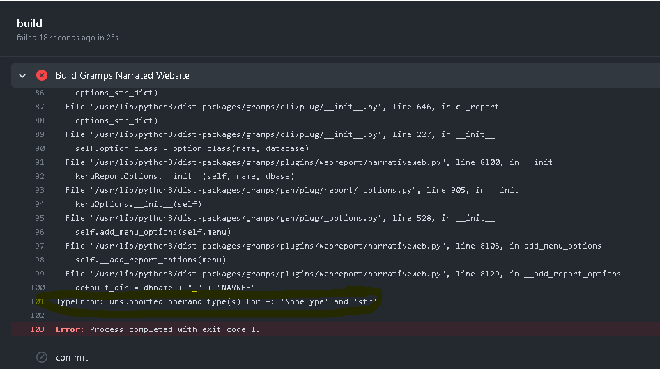

So I have added the following workaround which fixes the issue 

```
# Workaround for bug in database name in Gramps generic.py
sed -i 's/name.txt/database.txt/g' /usr/lib/python3/
```


## Push Files Up Into Github Repo

Now from with the gramps folder in cmd prompt commit the changes and push them up into the gramps github repo

```
git status
git add --all
git commit -m "Adds Gramps GEDCOM and Github Actions config"
git push
```

The output of these commands should look something like this 

```
C:\Users\laverty\Documents\gramps>git status
On branch main
Your branch is up to date with 'origin/main'.

Untracked files:
  (use "git add <file>..." to include in what will be committed)
        .github/
        gramps.ged

nothing added to commit but untracked files present (use "git add" to track)

C:\Users\laverty\Documents\gramps>git add --all

C:\Users\laverty\Documents\gramps>git commit -m "Adds Gramps GEDCOM and Github Actions config"
[main c5d44aa] Adds Gramps GEDCOM and Github Actions config
 2 files changed, 78 insertions(+)
 create mode 100644 .github/workflows/gramps.yml
 create mode 100644 gramps.ged

C:\Users\laverty\Documents\gramps>git push
Enumerating objects: 7, done.
Counting objects: 100% (7/7), done.
Delta compression using up to 8 threads
Compressing objects: 100% (4/4), done.
Writing objects: 100% (6/6), 1.15 KiB | 1.15 MiB/s, done.
Total 6 (delta 0), reused 0 (delta 0), pack-reused 0
To https://github.com/alexlaverty/gramps.git
   5c79a95..c5d44aa  main -> main
```

## Verify GitHub Actions WorkFlow Build

Once you have successfully pushed your gedcom and gramps.yml file up into your github repository,
browse your Github repository, click the **Actions** tab, click the Gramps workflow and you should see a build, click the build link

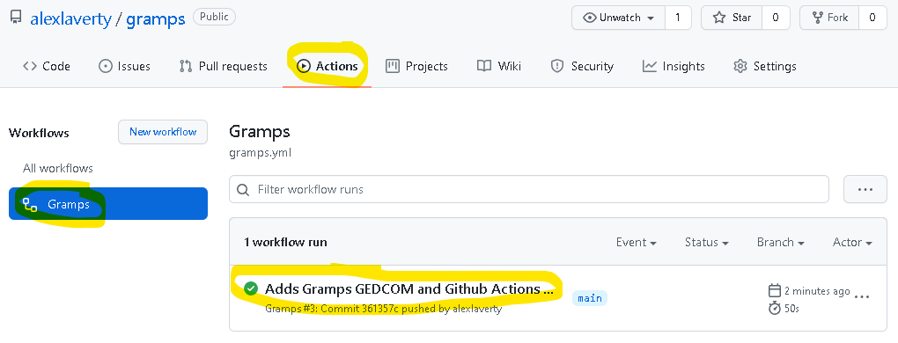


Click **build**

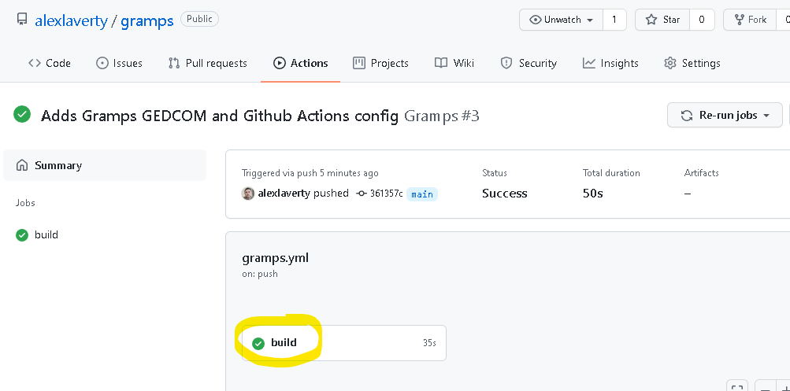

And you can now see each of the build steps 

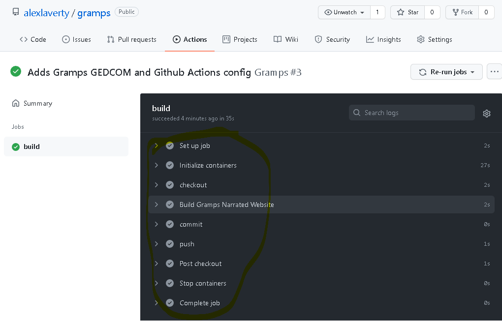

If you click into each of the build steps you can see the log output to help with troubleshooting if you get any errors

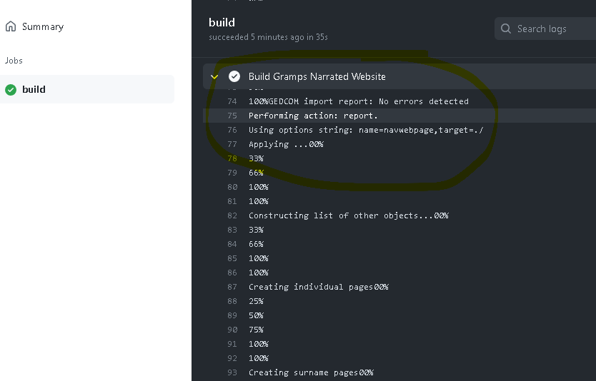

## Browse Your Gramps Narrated Website 

Now that the build is completed and successful, go back to your Settings -> Pages tab and click the link to your page 

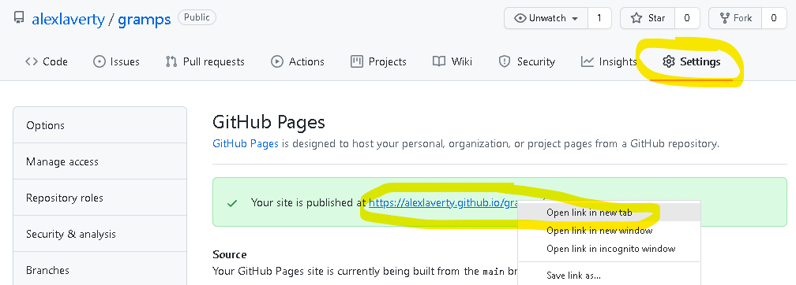

You now have a browsable Gramp Narrated Website

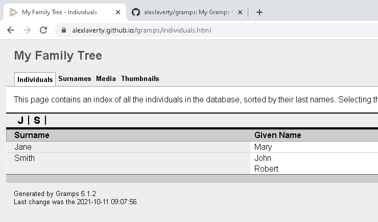

## Pushing Updates To Your Gramps Website

Now that you have set up this build pipeline, to update the website all you need to do is check in an updated GEDCOM file

Open up Gramps application, make some modifications to your Family Tree, export it using the previous instructions and then commit and push it into your gramps github repo

```
git pull
git add --all
git commit -m "Added Ronald and Emily Smith"
git push
```

Once the build has completed, refresh your browser and the new updates will appear in your Gramps Narrated Website.

If you have any questions please comment below.

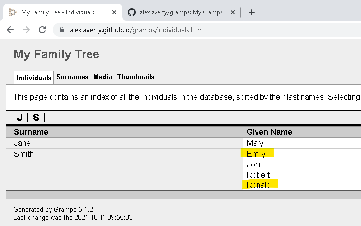

