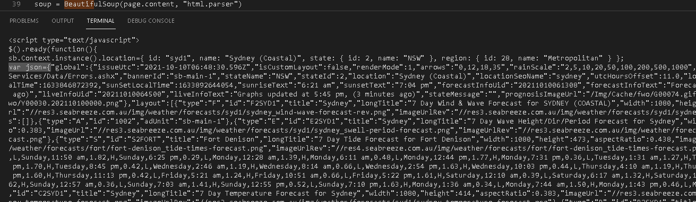
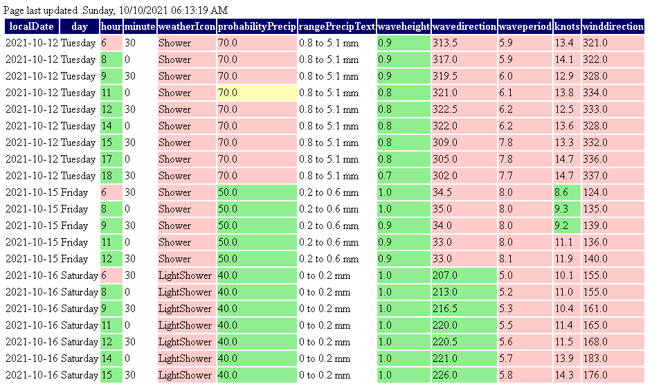

# Creating a Daily Surf Rating Report

- [Creating a Daily Surf Rating Report](#creating-a-daily-surf-rating-report)
  - [Introduction](#introduction)
  - [Choosing a Programming Language](#choosing-a-programming-language)
  - [Scraping Forecast Data with BeautifulSoup](#scraping-forecast-data-with-beautifulsoup)
  - [Parsing the JSON Data](#parsing-the-json-data)
  - [Adding Data to Pandas Data Frame](#adding-data-to-pandas-data-frame)
  - [Figuring out Weird Wave and Wind Data Structure](#figuring-out-weird-wave-and-wind-data-structure)
  - [Export Dataframe as a HTML Table with CSS Styling](#export-dataframe-as-a-html-table-with-css-styling)
  - [Generate Deployment on a Daily Schedule Using Github Action Workflow](#generate-deployment-on-a-daily-schedule-using-github-action-workflow)

## Introduction

I like to go to the beach and often find myself checking the Sydney surf forecast at Seabreeze.com.au 

<https://www.seabreeze.com.au/weather/wind-forecast/sydney>

It can take a little while to look at each day and use my mouse to hover over the chart to see wind speed and wave height etc and check the second chart for swell period and direction.

I wanted to see if I could write a script that would scrape this data for me, put it into a table, apply my personal surf condition preferences to the table and also filter out days where the surf was bad and make it accessible on this website, the end result is this report :

https://alexlaverty.github.io/surf/index.html

Green is good, red is bad, the more green cells on a row, the better the conditions will be.

## Choosing a Programming Language

This script could be written using various programming languages, I am currently learning Python so I have chosen it to write the script, Python also has the Pandas library at our disposal which is pretty powerful. 

## Scraping Forecast Data with BeautifulSoup

To get started we will scrape the surf forecast data using the python library BeautifulSoup.

This snippet of code will connect to the Seabreeze forecast for Sydney and retrieve the websites HTML code :

```
from bs4 import BeautifulSoup
import requests 

url = "https://www.seabreeze.com.au/weather/wind-forecast/sydney"

page = requests.get(url)         
soup = BeautifulSoup(page.content, "html.parser")

print(soup)
```

Copy and paste this view-source link into your chrome browser to see what that html code looks like :

<view-source:https://www.seabreeze.com.au/weather/wind-forecast/sydney>

## Parsing the JSON Data

Scrolling through the HTML I can see a bunch of interesting data embedded in JSON value in `var json={}` :



Using regex I grab `script` instances that match the text with the following expression `var json={.*};`

I was having trouble parsing this text as JSON so had to do some string replacing to get it working,

I'm sure there's a better regex expression that could exactly match what I needed, but that can be a future improvement.

```
# Needs a better regex expression
pattern = re.compile(r'var json={.*};', re.DOTALL)

script = soup.find('script', text=pattern)

data = pattern.search(script.text).group(0)

# tidies beginning and end of json string so json.loads works correctly
data = data.replace("var json=", "")
data = data.replace("};", "}")

self.json = json.loads(data)
```

Once we've extracted the JSON properly we have something like this to extract values from :

```
print(json)


{'global': {'issueUtc': '2021-10-10T07:00:58.852Z', 'isCustomLayout': False, 'renderMode': 1, 'arrows': '0,12,18,35', 'rainScale': '2,5,10,20,50,100,200,500,1000', 'reportErrors': True, 'reportUrl': '/Services/Data/Errors.ashx', 'bannerId': 'sb-main-1', 'stateName': 'NSW', 'stateId': 2, 'location': 'Sydney (Coastal)', 'locationSeoName': 'sydney', 'utcHoursOffset': 11.0, 'localTime': 1633888858852, 'sunRiseLocalTime': 1633846872392, 'sunSetLocalTime': 1633892644054, 'sunriseText': '6:21 am', 'sunsetText': '7:04 pm', 'forecastInfoUid': '20211010061308', 'forecastInfoText': 'Forecast 
updated at 5:13 pm, (47 minutes ago)', 'liveInfoUid': '20211010065500', 'liveInfoText': 'Graphs updated at 5:55 pm, (5 minutes ago)', 'stateMessage': '', 'prognosisImageUrl': '/Img/Cache/fwo/G00074.gif', 'synopticImageUrl': '/Img/Cache/fwo/Y00030.202110100000.png'}, 'layout': [{'type': 'F', 'id': 'F2SYD1', 'title': 'Sydney', 'longTitle': '7 Day Wind & Wave Forecast for SYDNEY (COASTAL)', 'width': 1080, 'height': 475, 'aspectRatio': 0.44, 'imageUrl': '//res3.seabreeze.com.au/img/weather/forecasts/syd1/sydney_wind-wave-forecast-rev.png', 'imageUrlRev': '//res3.seabreeze.com.au/img/weather/forecasts/syd1/sydney_wind-wave-forecast.png', 'messages': []}, {'type': 'A', 'id': '1002', 'adUnit': 'sb-main-1'}, {'type': 'E', 'id': 'E2SYD1', 'title': 'Sydney', 'longTitle': '7 Day Wave 
Height/Dir/Period Forecast for Sydney', 'width': 1080, 'height': 414, 'aspectRatio': 0.383, 'imageUrl': '//res3.seabreeze.com.au/img/weather/forecasts/syd1/sydney_swell-period-forecast.png', 'imageUrlRev': '//res3.seabreeze.com.au/img/weather/forecasts/syd1/sydney_swell-period-forecast.png'}, {'type': 'S', 'id': 'S2FORT', 'title': 'Fort Denison', 'longTitle': '7 Day Tide Forecast for Fort 
Denison', 'width': 1080, 'height': 473, 'aspectRatio': 0.438, 'imageUrl': '//res4.seabreeze.com.au/img/weather/forecasts/fort/fort-denison_tide-times-forecast.png', 'imageUrlRev': '//res4.seabreeze.com.au/img/weather/forecasts/fort/fort-denison_tide-times-forecast.png', 'tides': '4,Sunday,5:23 am,0.37,L,Sunday,11:50 am,1.82,H,Sunday,6:25 pm,0.29,L,Monday,12:28 am,1.39,H,Monday,6:11 am,0.48,L,Monday,12:44 pm,1.77,H,Monday,7:31 pm,0.36,L,Tuesday,1:31 am,1.27,H,Tuesday,7:07 am,0.58,L,Tuesday,1:44 pm,1.70,H,Tuesday,8:45 pm,0.42,L,Wednesday,2:46 am,1.19,H,Wednesday,8:14 am,0.66,L,Wednesday,2:54 pm,1.63,H,Wednesday,10:03 pm,0.44,L,Thursday,4:10 am,1.19,H,Thursday,9:33 am,0.69,L,Thursday,4:11 pm,1.60,H,Thursday,11:13 pm,0.42,L,Friday,5:21 am,1.24,H,Friday,10:51 am,0.66,L,Friday,5:22 pm,1.61,H,Saturday,12:10 am,0.39,L,Saturday,6:17 am,1.32,H,Saturday,11:58 am,0.59,L,Saturday,6:20 pm,1.62,H,Sunday,12:57 am,0.36,L,Sunday,7:03 am,1.41,H,Sunday,12:55 pm,0.52,L,Sunday,7:10 pm,1.63,H,Monday,1:36 am,0.34,L,Monday,7:44 am,1.50,H,Monday,1:43 pm,0.46,L,Monday,7:53 pm,1.62,H'}, {'type': 'C', 'id': 'C2SYD1', 'title': 'Sydney', 'longTitle': '7 Day Temperature Forecast for Sydney', 'width': 1080, 'height': 414, 'aspectRatio': 0.383, 'imageUrl': '//res3.seabreeze.com.au/img/weather/forecasts/syd1/sydney_temperature-forecast.png', 'imageUrlRev': '//res3.seabreeze.com.au/img/weather/forecasts/syd1/sydney_temperature-forecast.png'}, {'type': 'R', 'id': 'R2SYD1', 'title': 'Sydney', 'longTitle': '7 Day Rain Forecast for Sydney', 'width': 1080, 'height': 414, 'aspectRatio': 0.383, 'imageUrl': '//res3.seabreeze.com.au/img/weather/forecasts/syd1/sydney_rain-forecast.png', 'imageUrlRev': '//res3.seabreeze.com.au/img/weather/forecasts/syd1/sydney_rain-forecast.png'}, {'type': 'P', 'id': 'P2SDAP', 'title': 'Sydney Airport', 'longTitle': 'Temperature / Air Pressure at Sydney Airport', 'width': 1080, 'height': 331, 'aspectRatio': 0.306, 'imageUrl': '//res4.seabreeze.com.au/img/weather/reports/sdap/sydney-airport_pressure-temperature-report.png', 'imageUrlRev': '//res4.seabreeze.com.au/img/weather/reports/sdap/sydney-airport_pressure-temperature-report.png'}, {'type': 'W', 'id': 'W2NORT', 'title': 'North Head', 'longTitle': 'North Head Live Wind Report', 'width': 1080, 'height': 414, 'aspectRatio': 0.383, 'imageUrl': '//res4.seabreeze.com.au/img/weather/reports/nort/north-head_wind-report-rev.png', 'imageUrlRev': '//res4.seabreeze.com.au/img/weather/reports/nort/north-head_wind-report.png'}, {'type': 'W', 'id': 'W2SYD3', 'title': 'Sydney Harbour', 'longTitle': 'Sydney Harbour Live Wind Report', 'width': 1080, 'height': 414, 'aspectRatio': 0.383, 'imageUrl': '//res1.seabreeze.com.au/img/weather/reports/syd3/sydney-harbour_wind-report-rev.png', 'imageUrlRev': '//res1.seabreeze.com.au/img/weather/reports/syd3/sydney-harbour_wind-report.png'}, {'type': 'W', 'id': 'W2FORT', 'title': 'Fort Denison', 'longTitle': 'Fort Denison Live Wind Report', 'width': 1080, 'height': 414, 'aspectRatio': 0.383, 'imageUrl': '//res4.seabreeze.com.au/img/weather/reports/fort/fort-denison_wind-report-rev.png', 'imageUrlRev': '//res4.seabreeze.com.au/img/weather/reports/fort/fort-denison_wind-report.png'}, {'type': 'W', 'id': 'W2SDAP', 'title': 'Sydney Airport', 'longTitle': 'Sydney Airport Live Wind Report', 'width': 1080, 'height': 
414, 'aspectRatio': 0.383, 'imageUrl': '//res4.seabreeze.com.au/img/weather/reports/sdap/sydney-airport_wind-report-rev.png', 'imageUrlRev': '//res4.seabreeze.com.au/img/weather/reports/sdap/sydney-airport_wind-report.png'}, {'type': 'A', 'id': '1102', 'adUnit': 'sb-main-2'}, {'type': 'W', 'id': 'W2LITT', 'title': 'Little Bay', 'longTitle': 'Little Bay Live Wind Report', 'width': 1080, 'height': 414, 'aspectRatio': 0.383, 'imageUrl': '//res2.seabreeze.com.au/img/weather/reports/litt/little-bay_wind-report-rev.png', 'imageUrlRev': '//res2.seabreeze.com.au/img/weather/reports/litt/little-bay_wind-report.png'}, {'type': 'W', 'id': 'W2KURN', 'title': 'Kurnell', 'longTitle': 'Kurnell Live Wind Report', 'width': 1080, 'height': 414, 'aspectRatio': 0.383, 'imageUrl': '//res1.seabreeze.com.au/img/weather/reports/kurn/kurnell_wind-report-rev.png', 'imageUrlRev': '//res1.seabreeze.com.au/img/weather/reports/kurn/kurnell_wind-report.png'}, {'type': 'W', 'id': 'W2CRON', 'title': 'Cronulla', 'longTitle': 'Cronulla Live Wind Report', 'width': 1080, 'height': 414, 'aspectRatio': 0.383, 'imageUrl': '//res4.seabreeze.com.au/img/weather/reports/cron/cronulla_wind-report-rev.png', 'imageUrlRev': '//res4.seabreeze.com.au/img/weather/reports/cron/cronulla_wind-report.png'}, {'type': 'T', 'id': 'T2FORT', 'title': 'Fort Denison', 'longTitle': 'Live Tide at Fort Denison', 'width': 1080, 'height': 414, 'aspectRatio': 0.383, 'imageUrl': '//res4.seabreeze.com.au/img/weather/reports/fort/fort-denison_tide-times-report.png', 'imageUrlRev': '//res4.seabreeze.com.au/img/weather/reports/fort/fort-denison_tide-times-report.png'}, {'type': 'A', 'id': '1002', 'adUnit': 'sb-main-3'}], 'data': ['F,2,SYD1,68,1012,0,16798,0,16798,SYDNEY (COASTAL),6,117,202110100000,202110162359,636,1905,12,8,0,0,0,0,0,0,0,0,0,0,0,0,17,27,0,Rain at times. Possible storm.,Storm,95,13.2 to 22.8 mm,,,,,,11,17,1,Showers.,Shower,90,4 to 7.7 mm,,,,,,13,20,2,Shower or two.,Shower,50,0.8 to 5.1 mm,,,,,,13,21,3,Showers.,Shower,80,1.7 to 7 mm,,,,,,14,25,4,Showers.,Shower,80,1.1 to 5.8 mm,,,,,,13,23,5,Possible shower.,LightShower,40,0.2 to 0.6 mm,,,,,,12,24,6,Mostly sunny.,MostlySunnyPartlyCloudy,30,0 to 0.2 mm,,,,,,,,7 Day Wind & Wave Forecast for SYDNEY (COASTAL),-400,19,NE,0.55,SSE,8.0,-250,16,NNE,0.62,E,6.4,-100,13,NNE,0.71,NE,5.0,50,12,N,0.71,NE,5.2,200,11,N,0.69,NE,5.4,350,9,N,0.66,NE,5.6,500,8,N,0.65,ENE,5.9,650,8,N,0.64,ENE,6.1,800,8,N,0.64,ENE,6.4,950,9,W,0.62,NE,6.4,1100,10,SSW,0.61,NE,6.6,1250,18,SSW,0.71,NE,6.7,1400,21,S,0.88,SSW,4.4,1550,24,S,1.02,S,5.2,1700,21,S,1.02,S,5.6,1850,20,S,0.92,S,5.7,2000,19,S,0.92,S,5.7,2150,19,S,0.96,S,5.9,2300,18,S,0.94,S,6.3,2450,19,S,0.93,S,6.4,2600,21,S,0.93,S,6.5,2750,25,S,1.05,S,6.4,2900,24,S,1.30,S,6.6,3050,24,S,1.42,S,7.0,3200,22,S,1.44,S,7.2,3350,19,S,1.38,S,7.3,3500,18,S,1.25,S,7.2,3650,18,S,1.13,S,7.0,3800,19,S,1.04,S,6.8,3950,18,SSE,0.99,S,6.6,4100,19,SSE,0.95,S,6.5,4250,17,SSE,0.93,S,6.5,4400,17,SE,0.91,S,6.4,4550,16,SE,0.88,S,6.4,4700,16,SE,0.86,S,6.4,4850,15,SE,0.84,S,6.3,5000,15,ESE,0.81,SSE,6.2,5150,15,ESE,0.78,SSE,6.1,5300,13,ESE,0.76,SSE,6.0,5450,13,ESE,0.75,SSE,5.9,5600,14,ESE,0.75,SSE,5.9,5750,13,ESE,0.75,SSE,5.9,5900,14,ESE,0.75,SSE,5.9,6050,14,ESE,0.74,SE,5.9,6200,15,ESE,0.72,SE,5.8,6350,14,ESE,0.71,SE,6.9,6500,15,ESE,0.69,SSE,7.8,6650,14,E,0.69,SSE,7.8,6800,13,E,0.68,SSE,7.7,6950,13,E,0.67,SSE,7.6,7100,11,E,0.66,SSE,7.5,7250,11,E,0.66,SSE,7.4,7400,11,ENE,0.66,SSE,7.4,7550,11,ENE,0.68,SSE,7.4,7700,9,ENE,0.68,SSE,7.4,7850,10,ENE,0.69,SSE,7.4,8000,11,ENE,0.72,SE,7.5,8150,10,NE,0.77,SSE,7.6,8300,11,NE,0.84,E,5.7,8450,11,ENE,0.87,E,5.6,8600,13,ENE,0.88,E,5.6,8750,14,ENE,0.88,E,5.6,8900,16,NE,0.92,ENE,5.4,9050,17,NE,0.97,ENE,5.4,9200,18,NE,1.00,ENE,5.6,9350,18,NE,1.00,ENE,5.6,9500,17,NNE,1.02,ENE,5.7,9650,16,NNE,1.06,ENE,5.8,9800,16,NNE,1.08,ENE,5.9,9950,14,NNE,1.11,ENE,5.9,10100,12,NNE,1.11,NE,6.1,10250,11,N,1.07,ENE,6.4,10400,11,N,1.05,ENE,6.4,10550,11,NNE,1.04,ENE,6.4,10700,12,N,1.06,ENE,6.5,10850,13,NNE,1.07,ENE,6.6,11000,15,NNE,1.14,ENE,6.7,11150,16,NE,1.23,ENE,6.8,11300,19,NE,1.31,ENE,6.8,11450,17,NNE,1.37,ENE,7.1,11600,17,N,1.37,ENE,7.4,11750,15,NNW,1.28,ENE,7.6,11900,12,NW,1.22,NE,7.6,12050,10,NW,1.16,ENE,7.8,1......................,0,17.2'}]}]}
```

if we focus in on the forecast we can then access each day individually :

```
forecast = json["forecasts"][0]["forecast"]

for day in forecast:
    print("--------------------------")
    print(day)
    print("--------------------------")

--------------------------
{'localDate': '2021-10-10', 'day': 'Sunday', 'minTemp': 17.0, 'maxTemp': 27.0, 'shortDesc': 'Rain at times. Possible storm.', 'skyIcon': None, 'weatherIcon': 'Storm', 'probabilityPrecip': 95.0, 'rangePrecipText': '13.2 to 22.8 mm', 'sunrise': '636', 'sunset': '1905', 'moonPhase': 0.703, 'wind': '4,0,30,11.9,83,2,0,10.8,92,3,30,9,88,5,0,8.1,87,6,30,8.3,96,8,0,8.3,101,9,30,8.6,174,11,0,10,249,12,30,17.5,250,14,0,21.3,265,15,30,23.5,270,17,0,21.1,274,18,30,20.3,274,20,0,19.4,276,21,30,19,271,23,0,18,267', 'waves': '5,0,30,0.7,38,5.2,2,0,0.7,37,5.4,3,30,0.7,35,5.6,5,0,0.6,33,5.9,6,30,0.6,33,6.1,8,0,0.6,33,6.4,9,30,0.6,34.5,6.4,11,0,0.6,36,6.6,12,30,0.7,35.5,6.7,14,0,0.9,257,4.4,15,30,1,260.5,5.2,17,0,1,266,5.6,18,30,0.9,266.5,5.7,20,0,0.9,269,5.7,21,30,1,273,5.9,23,0,0.9,278,6.3', 'tides': '4,5,23,0.37,L,11,50,1.82,H,18,25,0.29,L', 'temperature': '3,0,0,20,1,0,19.9,2,0,19.9,3,0,19.6,4,0,19.6,5,0,19.4,6,0,19.2,7,0,19.1,8,0,18.8,9,0,18.8,10,0,19.2,11,0,19.3,12,0,19.2,13,0,19.3,14,0,18.8,15,0,18.5,16,0,18.4,17,0,17.7,18,0,17.8,19,0,17.3,20,0,17,21,0,16.8,22,0,16.7,23,0,16.6,0,0,16.8,1,0,16.4,2,0,16,3,0,15.6,4,0,15.3,5,0,14.7,6,0,14.4,7,0,14.1,8,0,13.8,9,0,13.7,10,0,13.9,11,0,14,12,0,14,13,0,14.9,14,0,15,15,0,15.2,16,0,15.7,17,0,15.5,18,0,15.7,19,0,15.7,20,0,15.7,21,0,15.9,22,0,16.1,23,0,16.2,0,0,16.1,1,0,16,2,0,16,3,0,15.8,4,0,15.7,5,0,15.6,6,0,15.4,7,0,15.5,8,0,15.2,9,0,15.2,10,0,15.5,11,0,15.7,12,0,15.8,13,0,16.6,14,0,16.6,15,0,16.6,16,0,16.9,17,0,16.5,18,0,16.6,19,0,16.6,20,0,16.5,21,0,16.4,22,0,16.5,23,0,16.5,0,0,16.4,1,0,16.3,2,0,16.2,3,0,16.1,4,0,16.2,5,0,16.2,6,0,16.1,7,0,16.1,8,0,15.7,9,0,15.7,10,0,16.1,11,0,16.3,12,0,16.4,13,0,17.4,14,0,17.7,15,0,17.6,16,0,18.1,17,0,17.8,18,0,17.9,19,0,17.9,20,0,17.8,21,0,17.9,22,0,18,23,0,18.1,0,0,18,1,0,17.9,2,0,17.8,3,0,17.5,4,0,17.4,5,0,17.1,6,0,17,7,0,16.9,8,0,16.7,9,0,16.8,10,0,17.3,11,0,17.6,12,0,18.1,13,0,19.2,14,0,19.5,15,0,19.6,16,0,20.1,17,0,19.8,18,0,19.8,19,0,19.7,20,0,19.6,21,0,19.5,22,0,19.4,23,0,19.4,0,0,19,1,0,18.6,2,0,18.1,3,0,17.6,4,0,17.3,5,0,17,6,0,16.8,7,0,16.7,8,0,16.4,9,0,16.4,10,0,16.8,11,0,17.2,12,0,17.7,13,0,18.9,14,0,19.3,15,0,19.3,16,0,19.7,17,0,19.5,18,0,19.2,19,0,18.8,20,0,18.3,21,0,17.9,22,0,17.5,23,0,17.2,0,0,16.7,1,0,16.4,2,0,16.1,3,0,15.8,4,0,15.7,5,0,15.4,6,0,15.3,7,0,15.3,8,0,15.2,9,0,15.7,10,0,16.7,11,0,17.5,12,0,18.1,13,0,19.2,14,0,19.5,15,0,19.7,16,0,20.2,17,0,19.9,18,0,19.6,19,0,19.1,20,0,18.6,21,0,18.1,22,0,17.6,23,0,17.2'}
--------------------------

```

We can then also start accessing individual values :

```
forecast = json["forecasts"][0]["forecast"]

for day in forecast:
    print("--------------------------")
    print(day['maxTemp'])
    print(day['shortDesc'])
    print(day['waves'])
    print("--------------------------")


--------------------------
23.0
Possible shower.
5,0,30,1.2,31.5,7.8,2,0,1.1,33,7.8,3,30,1,33,7.8,5,0,1,33,7.8,6,30,1,34.5,7.9,8,0,1,36,7.9,9,30,1,36.5,7.9,11,0,0.9,37,7.9,12,30,0.9,37,7.9,14,0,0.9,37,7.9,15,30,0.9,36.5,7.9,17,0,1,36,7.9,18,30,1,34.5,7.9,20,0,0.9,33,7.9,21,30,0.9,31.5,7.9,23,0,0.9,30,7.8
--------------------------
```

## Adding Data to Pandas Data Frame

Now that we can get values we want it's time to create a Pandas Dataframe and add the values in.
If you are not across Dataframes think Excel Spreadsheet, like a table that has Columns and Rows that you can perform operations on.

Here we'll define the Column headers, loop through the forecast and append our values to a Python List `data = []`, then convert that python list to a dataframe and then print the contents of the dataframe.

This Stackoverflow page discusses why it's better to append to a list and then convert to a dataframe rather than create a dataframe and append to it row by row :

[Stackoverflow - Create a Pandas Dataframe by appending one row at a time](https://stackoverflow.com/a/17496530)

```
headers = [
            'localDate',
            'day',
            'hour',
            'minute',
            'minTemp',
            'maxTemp',
            'shortDesc',
            'weatherIcon',
            'probabilityPrecip',
            'rangePrecipText',
            'sunrise',
            'sunset',
            'moonPhase'
        ]

import pandas as pd

data = []

for day in forecast:  

        data.append(
            [
                day['localDate'],
                day['day'],
                "0",
                "0",
                day['minTemp'],
                day['maxTemp'],
                day['shortDesc'],
                day['weatherIcon'],
                day['probabilityPrecip'],
                day['rangePrecipText'],
                day['sunrise'],
                day['sunset'],
                day['moonPhase']
            ]
        )
    
df = pd.DataFrame(data, columns=headers)

print(df)


    localDate        day hour minute  minTemp  maxTemp                       shortDesc              weatherIcon  probabilityPrecip  rangePrecipText sunrise sunset  moonPhase
0  2021-10-10     Sunday    0      0     17.0     27.0  Rain at times. Possible storm.                    Storm               95.0  13.2 to 22.8 mm     636   1905      0.703
1  2021-10-11     Monday    0      0     11.0     17.0                        Showers.                   Shower               90.0      4 to 7.7 mm     635   1906      0.941
2  2021-10-12    Tuesday    0      0     13.0     20.0                  Shower or two.                   Shower               50.0    0.8 to 5.1 mm     631   1906      1.179
3  2021-10-13  Wednesday    0      0     13.0     21.0                        Showers.                   Shower               80.0      1.7 to 7 mm     630   1908      1.415
4  2021-10-14   Thursday    0      0     14.0     25.0                        Showers.                   Shower               80.0    1.1 to 5.8 mm     628   1910      1.648
5  2021-10-15     Friday    0      0     13.0     23.0                Possible shower.              LightShower               40.0    0.2 to 0.6 mm     626   1911      1.877
6  2021-10-16   Saturday    0      0     12.0     24.0                   Mostly sunny.  MostlySunnyPartlyCloudy               30.0      0 to 0.2 mm     623   1913      2.101

```

## Figuring out Weird Wave and Wind Data Structure

So now we have most of the data added to our dataframe. 

However looking at the waves and wind data had me scratching my head... 

```
waves = 4,0,30,11.9,83,2,0,10.8,92,3,30,9,88,5,0,8.1,87,6,30,8.3,96,8,0,8.3,101,9,30,8.6,174,11,0,10,249,12,30,17.5,250,14,0,21.3,265,15,30,23.5,270,17,0,21.1,274,18,30,20.3,274,20,0,19.4,276,21,30,19,271,23,0,18,267


wind = 5,0,30,0.7,38,5.2,2,0,0.7,37,5.4,3,30,0.7,35,5.6,5,0,0.6,33,5.9,6,30,0.6,33,6.1,8,0,0.6,33,6.4,9,30,0.6,34.5,6.4,11,0,0.6,36,6.6,12,30,0.7,35.5,6.7,14,0,0.9,257,4.4,15,30,1,260.5,5.2,17,0,1,266,5.6,18,30,0.9,266.5,5.7,20,0,0.9,269,5.7,21,30,1,273,5.9,23,0,0.9,278,6.3
```

This is supposed to be values of how high the waves are over the day :

```
waves = 4,0,30,11.9,83,2,0,10.8,92,3,30,9,88,5,0,8.1,87,6,30,8.3,96,8,0,8.3,101,9,30,8.6,174,11,0,10,249,12,30,17.5,250,14,0,21.3,265,15,30,23.5,270,17,0,21.1,274,18,30,20.3,274,20,0,19.4,276,21,30,19,271,23,0,18,267
```

Are the waves supposed to be 4 metres and then 0 metres and then 30 metres high and then 11.9 and then 83 metres high???

After staring at the numbers for a while, banging my head against the wall and questioning my life choices that had brought me to this point in time.

I had a light bulb moment and realised that there were columns embedded inside this string of numbers.

The first number was something to do with which chart it was displayed on, or which chart series.

Then the next number was the hour, then the minute, the Height of the waves, the direction of the waves and then the last column was the swell period.

```
"waves": "  5,
            Hour Min Height Direction Swell Period
            1,   0,   0.5,  310,      9.8,
            2,   30,  0.5,  305,      9.8,
            4,   0,   0.5,  300,      9.8,
            5,   30,  0.6,  282.5,    +,
            7,   0,   0.7,  220,      4,
            8,   30,  0.8,  220,      4.6,
            10,  0,   0.9,  225,      4.9,
            11,  30,  0.9,  247,      8.1,
            13,  0,   1.2,  262,      11.3,
            14,  30,  1.5,  265,      10.9,
            16,  0,   1.7,  263,      9.6,
            17,  30,  1.6,  262.5,    9.2,
            19,  0,   1.6,  263,      9,
            20,  30,  1.5,  264,      8.7,
            22,  0,   1.4,  264,      8.4,
            23,  30,  1.4,  265.5,    8.2",
```

And it was a similar story for the wind :

```
"wind": "4,
        Hour Min Knts Direction
        1,   0,  9.4, 162,
        2,   30, 9.2, 183,
        4,   0,  11,  211,
        5,   30, 12.6,222,
        7,   0,  16,  223,
        8,   30, 18,  224"
```

Ok cool, now how do I split this string of numbers every 4 or 5 values and split it into columns in my Pandas Dataframe....

Split the wave data on the comma delimiter, 

```
wave_data = day['waves'].split(",")
```

delete the first value that signifies the chart or series, because I don't need it

```
del wave_data[0]
```

Then we [Split Python list every Nth element](https://stackoverflow.com/questions/26945277/how-to-split-python-list-every-nth-element)

```
wave_data = [wave_data[i:i+5] for i in range(0, len(wave_data), 5)]
```

Setup some dataframe headers 

```
headers = ['hour','minute','waveheight','wavedirection','waveperiod']
```

create DF using the wave data and headers 

```
df_wave = pd.DataFrame(wave_data,columns=headers)
```

And we are left with 

```
print(df_wave) 


      hour  minute     waveheight    wavedirection waveperiod
0     0     30         1.1           31.5         5.8
1     2      0         1.1           29.0         5.9
2     3     30         1.1           32.0         5.9
3     5      0         1.1           35.0         6.1
4     6     30         1.1           30.5         6.4
5     8      0         1.0           31.0         6.4
6     9     30         1.0           31.5         6.4
7    11      0         1.1           32.0         6.5
8    12     30         1.1           33.0         6.6
9    14      0         1.1           29.0         6.7
10   15     30         1.2           30.5         6.8
11   17      0         1.3           33.0         6.8
12   18     30         1.4           32.5         7.1
13   20      0         1.4           33.0         7.4
14   21     30         1.3           33.5         7.6
15   23      0         1.2           34.0         7.6

```

Once we've done the same for the wind we can then merge the DF's together

```
df_wave = df_wave.merge(df_wind, how='left', on=['hour','minute'])
```

## Export Dataframe as a HTML Table with CSS Styling

Now that we have a dataframe we our wave forecast data we can then export it as a html file and apply some colour styling to it

Configuring some CSS styling and colors 

```
cell_hover = {  # for row hover use <tr> instead of <td>
    'selector': 'td:hover',
    'props': [('background-color', '#ffffb3')]
}
index_names = {
    'selector': '.index_name',
    'props': ''
}
headers = {
    'selector': 'th:not(.index_name)',
    'props': 'background-color: #000066; color: white;'
}
```

Converting some columns to numbers 

```
s.dataframe["hour"] = pd.to_numeric(s.dataframe["hour"])
s.dataframe["minute"] = pd.to_numeric(s.dataframe["minute"])
```

Filtering out rows where the conditions are bad and won't be suitable to go to the beach 

Surf conditions I wanted included in the final report :

* The wind is less than 15 knots, I don't like the beach when it's too windy
* The time is above 6am but before 6pm, I am not interested in going too early before the sun is up or at night when the sun has gone down.
* I don't want to go to the beach when it's raining so I chose 70% chance of rain as my limit.
* I don't like when waves are too big so include rows where the surf is under 2 meters.

```
df_filtered = s.dataframe[s.dataframe.knots < 15 ]
df_filtered = df_filtered[(df_filtered['hour'] >= 6) & (df_filtered['hour'] <= 18)]
df_filtered = df_filtered[df_filtered.probabilityPrecip <= 70 ]
df_filtered = df_filtered[df_filtered.waveheight < 2 ]
```

Apply color styling to the table cells with rules similar to above, Green if the condition is favourable, Red if the condition is unfavourable.

```
with pd.option_context('display.precision', 1):
    df_style = df_filtered.style

df_style.hide_index()
df_style.applymap(lambda x: f"background-color: {'lightgreen' if (x > 6 and x < 20) else '#ffcccb'}", subset=['hour'])
df_style.applymap(lambda x: f"background-color: {'#ffcccb' if 'Shower' in x else 'lightgreen'}", subset=['weatherIcon'])
df_style.applymap(lambda x: f"background-color: {'#ffcccb' if x > 50 else 'lightgreen'}", subset=['probabilityPrecip'])
#df_style.applymap(lambda x: f"background-color: {'green' if x >= 20 else 'red'}", subset=['temperature'])
df_style.applymap(lambda x: f"background-color: {'lightgreen' if x >= 10 else '#ffcccb'}", subset=['waveperiod'])
df_style.applymap(lambda x: f"background-color: {'lightgreen' if x <= 10 else '#ffcccb'}", subset=['knots'])
df_style.applymap(lambda x: f"background-color: {'lightgreen' if (x > 225 and x < 315) else '#ffcccb'}", subset=['winddirection'])
df_style.applymap(lambda x: f"background-color: {'lightgreen' if (x > 40 and x < 250) else '#ffcccb'}", subset=['wavedirection'])
df_style.applymap(lambda x: f"background-color: {'lightgreen' if x < 2 else '#ffcccb'}", subset=['waveheight'])
```

I want a timestamp when the report is generated so I know it's current 

```
tz_Aus = pytz.timezone('Australia/Sydney')
datetime_Aus = datetime.now(tz_Aus)

html = html.render()
last_updated_time  = "Page last updated :" + datetime_Aus.strftime("%A, %d/%m/%Y %I:%M:%S %p")
html = last_updated_time + html
```

write html to file

```
text_file = open("index.html", "w")
text_file.write(html)
text_file.close()
```

If all goes well you should be able to open the index.html and it should look something like 

https://alexlaverty.github.io/surf/index.html



## Generate Deployment on a Daily Schedule Using Github Action Workflow

Now to get this report running everyday, we use my new favourite thing, Github Actions, and we schedule the script to run once a day.

You can checkout my Github Action Workflow yml at [.github/workflows/surf.yml](https://raw.githubusercontent.com/alexlaverty/alexlaverty.github.io/main/.github/workflows/surf.yml)


```
# Give your gitflow action a name
name: Surf

# Set a schedule to run, note it's in UTC time, so do the time conversion for your location
on:
  schedule:
    - cron: '0 19 * * *' # runs at 12:00 UTC everyday

# Also run the build if I push anything into the surf folder on the main branch
  push:
    paths:
      - 'surf/**'
    branches:
      - main
jobs:
  build:
    # RUN ON A UBUNTU SERVER
    runs-on: ubuntu-latest

    # RUN THE FOLLOWING COMMANDS IN THE SURF FOLDER
    env:
      working-directory: ./surf
    steps:

      - name: checkout repo content
        uses: actions/checkout@v2 # checkout the repository content to github runner

      - name: setup python
        uses: actions/setup-python@v2
        with:
          python-version: '3.7.7' # install the python version needed
          
      - name: install python packages
        run: |
          python -m pip install --upgrade pip
          pip install -r requirements.txt
        working-directory: ${{env.working-directory}}

        # EXECUTE THE PYTHON SCRIPT WE WROTE 
      - name: execute py script # run sj-gobierno.py to get the latest data
        run: python surf.py
        working-directory: ${{env.working-directory}}
          
      - name: commit files
        run: |
          git config --local user.email "action@github.com"
          git config --local user.name "GitHub Action"
          git add -A
          git commit -m "Surf Update" -a
        working-directory: ${{env.working-directory}}
          
      - name: push changes
        uses: ad-m/github-push-action@v0.6.0
        with:
          github_token: ${{ secrets.GITHUB_TOKEN }}
          branch: main  
```

