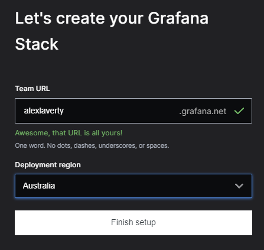

Exploring if Grafana Cloud is a viable solution to send some personal metrics to, to help with charting and visualisation.

Go to the Grafana website and setup a free granfana cloud account :

https://grafana.com/products/cloud/

Grafana free tier grants you the following :

* Grafana logoFree Forever Cloud
* 3 users
* 10,000 active series for metrics
* 50 GB of logs
* 50 GB of traces
* 30 notifications for OnCall
* 14-day retention

Register a name :

